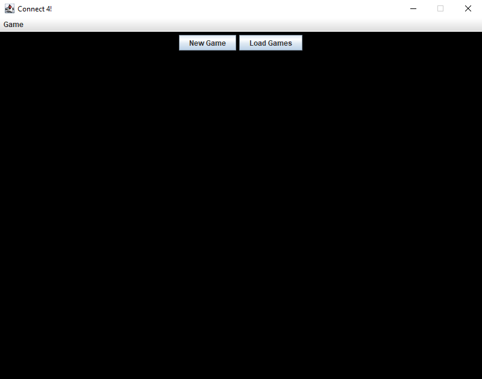
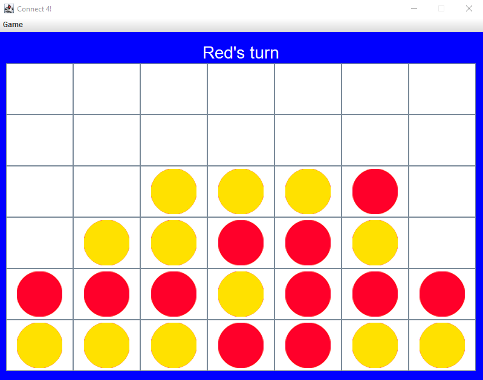
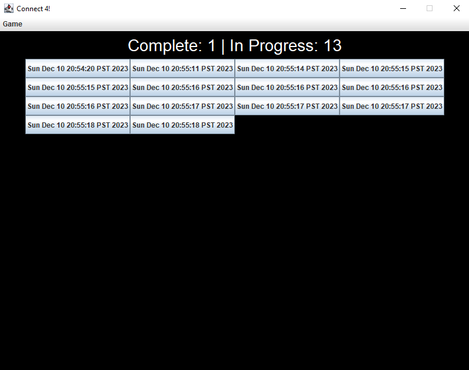

# Connect 4
CPSC 210 Course Project

  

The initial screen of Connect 4, featuring options to start a new game or load existing games.

  

  An example of the Game Ui.

  

The load menu, designed for users to view past games and manage game data by saving to or loading from disk.

# Below is Documentation for Grading
## Proposal
This is a desktop application for the children's game Connect 4. The target demographic for this application is people
who are looking to feel some nostalgia from an old familiar game. This project is of interest to me because while I have
never created a game with a fully functioning GUI before.

## User Stories
As a user, I want to be able to easily see where I am placing a piece \
As a user, I want to be able to add a piece on the board (either piece) \
As a user, I want to be able to know that the game has ended \
As a user, I want to be able to know who has won if the game has ended \
As a user, I want to be able to know if the game is drawn \
As a user, I want to be able to add a new game to the list of games \
As a user, I want to be able to view all the current gameList \
As a user, I want to be able to remove a game from the list of games \
As a user, I want to be able to see stats of all the current gameList (how many are complete/in progress) \
As a user, I want to be able to save the current games to a file (if I so choose) \
As a user, I want to be able to be able to load games from a file (if I so choose) \

## Instructions for Grader
### You can generate the first required action related to adding Xs to a Y by
Press "New Game." Then press "Game" in the top menu bar to go back to the main menu, or CTRL + 1 as a shortcut. \
Repeat as necessary, each time it will automatically save the game into memory. You can see the List of X by pressing
"Load Games" from the main menu.
### You can generate the second required action related to adding Xs to a Y by
I chose to implement a way to remove a game from the list of games. \
From the main menu, press "Load Games." (ensure that you have added at least one game). \
Then, Ctrl + Click on any of the buttons to remove the game.
### You can locate my visual component by
The visual component of this project are the red and yellow circle images in the GameUi that appear when a cell is 
pressed.
### You can save the state of my application by
From the menu bar, press "Game," then "Save As." The extension of the file should be ".json".
### You can reload the state of my application by
From the menu bar, press "Game," then "Open".

## Phase 4: Task 2
Added Game 'Sat Nov 25 19:40:08 PST 2023' \
Added Game 'Sat Nov 25 19:40:14 PST 2023' \
Removed Game 'Sat Nov 25 19:40:08 PST 2023' \
Removed Game 'Sat Nov 25 19:40:14 PST 2023' 

## Phase 4: Task 3
If I had more time to work on this project, I would consider refactoring out the Main Menu class.
This is because it doesn't add as much functionality as it did in the Terminal version of the game, mainly because
there is a menu bar now. In the refactored version, when you launch the GUI, instead of showing the main menu it would
just start a new game. Users would navigate to the Load Ui through the menu bar. As the menu bar is already required
to go back to the main menu, it would save a step if you could go directly to load games, while also removing a 
significant chunk of code.